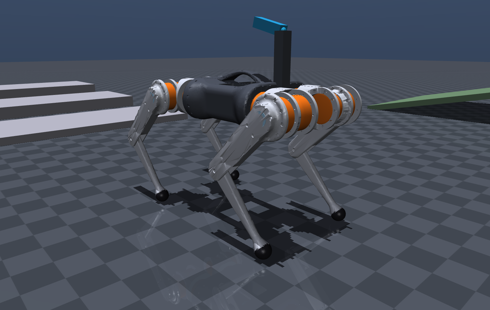
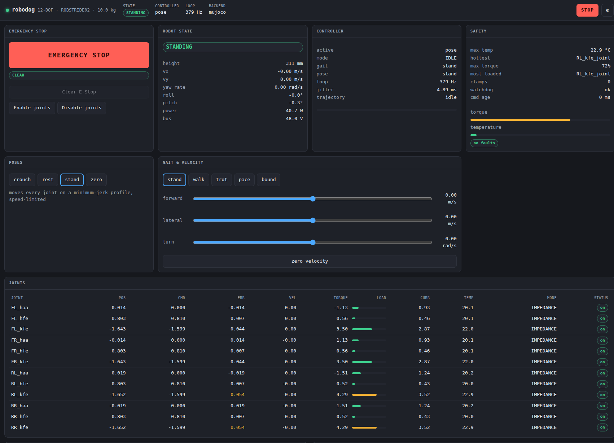
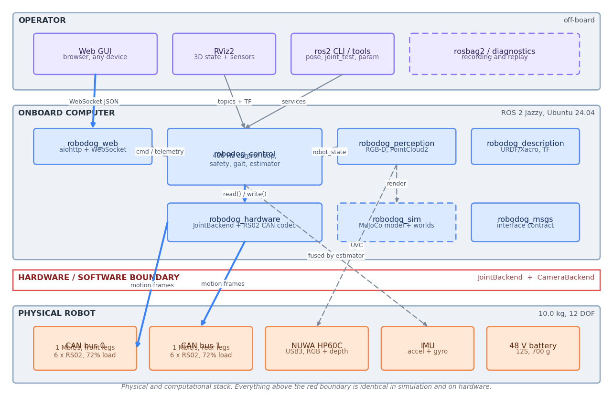
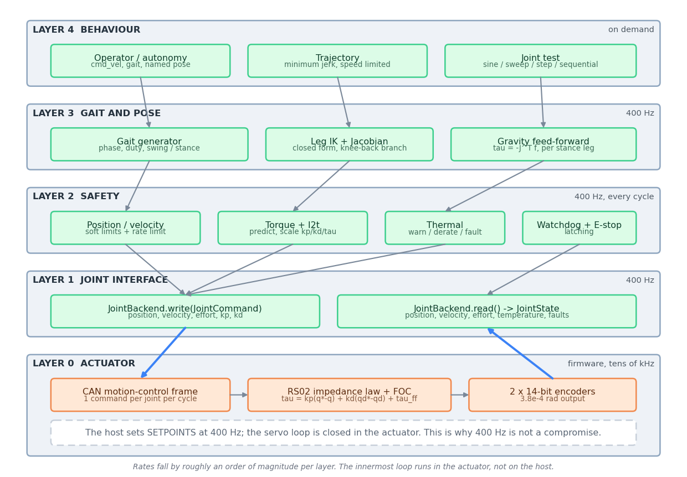
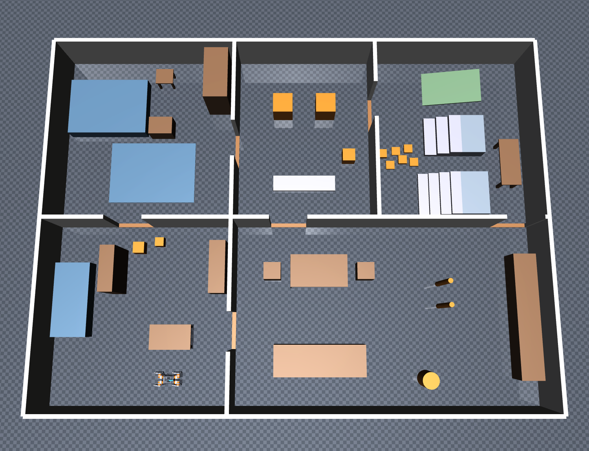

<h1 align="center">robodog</h1>

<p align="center">
  <b>Software architecture for a 12-DOF quadruped robot</b><br>
  12 × ROBSTRIDE02 QDD actuators · 10 kg · ROS 2 Jazzy · MuJoCo
</p>

<p align="center">
  
  
  
  
  
</p>

<p align="center">
  
</p>

---

## What this is

A complete, working **first software architecture** for a quadruped robot built
around twelve [ROBSTRIDE02](https://robstride.com) quasi-direct-drive actuators.
It takes a raw Onshape CAD export and turns it into a running robot stack: a
kinematic and inertial model, a 400 Hz control loop with a real safety layer,
gait generation, physics simulation with a five-room test house, an RGB-D
perception pipeline, and a web GUI you can drive it from.

Everything runs today, in simulation. **No hardware has been driven** — the
ROBSTRIDE02 CAN driver and the camera driver are written but unvalidated, and
the project is explicit about which numbers are measured and which are
estimates waiting for a real robot.

The organising idea is a single abstraction:

```python
class JointBackend(ABC):
    def read(self)  -> JointState        # position, velocity, effort, temperature, faults
    def write(self, cmd: JointCommand)   # position, velocity, effort, kp, kd
    def step(self, dt) -> None           # advance a simulator; a no-op on hardware
    def base_state(self) -> BaseState | None   # None on the real robot — it has no such sensor
```

Three implementations exist — ideal-kinematic, MuJoCo, and ROBSTRIDE02-over-CAN
— and the camera has the same arrangement. Switching from simulation to the
real robot is a launch argument. Not a topic, service, frame, message,
controller or gain changes.

`JointCommand` is deliberately the actuator's **native impedance frame**, which
is exactly one CAN message, because the RS02 closes
`τ = kp(q*−q) + kd(q̇*−q̇) + τ_ff` in firmware at tens of kHz. The host sets
setpoints; it is not the servo. That is also why 400 Hz is enough — and 400 Hz
is precisely what the two-bus CAN budget allows.

---

## Quick start

```bash
# dependencies beyond a standard ROS 2 Jazzy install
pip install mujoco          # physics and the simulated camera
pip install python-can      # only needed for real hardware

git clone https://github.com/farouk15160/robodog.git
cd robodog/ros2_ws
colcon build --symlink-install && source install/setup.bash

ros2 run robodog_sim generate_models        # build the MuJoCo models
ros2 launch robodog_bringup robot.launch.py backend:=mujoco world:=house
```

Open **http://localhost:8080** for the GUI. RViz starts alongside.

| Command | What it does |
|---|---|
| `ros2 launch robodog_bringup robot.launch.py` | ideal joints, no physics — fastest way to exercise the stack |
| `… backend:=mujoco world:=flat` | full physics on the calibration course |
| `… backend:=mujoco world:=house` | full physics in the five-room house |
| `… backend:=robstride02_can camera_backend:=nuwa_hp60c` | the real robot |
| `ros2 launch robodog_bringup display.launch.py` | inspect the URDF with joint sliders |
| `ros2 run robodog_sim viewer --world house` | MuJoCo viewer, no control stack |
| `ros2 run robodog_control pose stand` | move to a named pose |
| `ros2 run robodog_control joint_test --mode sweep` | chirp every joint |

If MuJoCo cannot open a GL context, set `MUJOCO_GL=egl` (or `osmesa`).

---

## The web GUI

<p align="center">
  
</p>

Live telemetry at 20 Hz over a small versioned JSON protocol — per-joint
position, tracking error, torque, current and temperature; foot contact and
forces; safety and thermal state; simulation real-time factor; the camera
stream; pose and gait commands; and an emergency stop.

The browser builds itself from `robodog_web/config/web.yaml`, so adding,
removing or reordering a panel is a configuration change. Operator limits —
maximum commanded velocity, gait confirmation, whether joint jogging is allowed
at all — are configuration too, not constants buried in JavaScript.

It speaks a purpose-built protocol rather than rosbridge: less bandwidth, and a
much smaller surface from a web page that can move a 10 kg machine.

---

## Architecture

<p align="center">
  
</p>

The red band is the hardware/software boundary. Everything above it is
identical whether the joints are integers in a simulator or real motors on a
CAN bus.

<p align="center">
  
</p>

Rates fall by roughly an order of magnitude per layer, and the innermost loop
is not on the host at all. The safety monitor is unconditional: it runs every
cycle, in simulation as well as on hardware, because a safety layer that only
activates on the real robot has never been tested by the time it matters.

Ten diagrams cover the system, software, node/topic, control, data-flow,
hardware-boundary, state-machine, domain, simulation and perception views. They
live in [`docs/diagrams/`](docs/diagrams) as editable **Draw.io** files and are
rendered to PDF and PNG from a single source by `tools/make_diagrams.py`.

---

## The test environment

<p align="center">
  
</p>

A 12 × 9 m five-room house containing every indoor locomotion problem the robot
has to solve, each with enough approach room to be attempted in isolation:

| Feature | Dimension | Measured against |
|---|---|---|
| Doorways | 0.90 m, with a 20 mm sill to step over | body width 0.240 m |
| Narrow gaps | 0.45 / 0.43 / 0.60 m | foot span 0.289 m |
| Stairs | 4 × 80 mm, and 3 × 120 mm as a stretch case | 0.24 m leg lift |
| Ramp | 12° | where µ = 0.9 stops holding a static stance |
| Under-table | 0.36–0.46 m clearance | 0.320 m stance height |
| Debris field | mixed 40–110 mm blocks | foothold selection |
| Movable props | four free bodies that topple | contact recovery |

**One world description, two renderers.** `world_spec.py` is consumed by both
the MuJoCo model builder and the RViz marker publisher, so what the operator
sees is geometrically what the robot collides with. `world_check.py` measures
every clearance quoted above from the spec, and the tests fail if an edit turns
a designed challenge into a wall or an open field.

---

## What works, and what doesn't

| | Status |
|---|---|
| Model, URDF, MuJoCo, TF, RViz | complete, and cross-checked against each other |
| Hardware and camera abstraction | complete — three joint backends, two camera backends |
| Safety layer | complete; runs in simulation and on hardware alike |
| Web GUI | complete — live telemetry, commands, camera |
| **Standing** | **solid** — 0.1° tilt, holds 320 mm, 5.5 N·m peak, no clamping |
| **Balance while stepping** | **works** — a 0.3 m/s trot holds 3° tilt at the commanded height (25° without it) |
| **Velocity tracking** | **not yet** — the robot steps in place; trot drifts backward ≈ 0.04 m/s |
| Real actuators and camera | written, **unvalidated** — no hardware has been driven |

The force-to-motion path is verified correct in isolation: commanding +30 N of
ground reaction with all four feet planted moves the robot forward 0.52 m, and
−30 N moves it backward. Locomotion is therefore a tuning and timing problem,
not a sign or architecture error. Getting past it needs contact detection
instead of a fixed gait schedule, slip handling, and co-tuning of stance
compliance against swing timing — work that only makes sense against identified
dynamics, and none of which changes an interface.

See §6.6 of [the documentation](docs/robodog_architecture.pdf) for the measured
numbers, and [CONTRIBUTING.md](CONTRIBUTING.md) if you would like to help.

---

## Repository layout

```
cad/                        Onshape export (input) and the RS02 vendor STEP
tools/                      CAD → model pipeline, meshes, diagrams, doc facts
ros2_ws/src/
  robodog_msgs/             message and service contract
  robodog_description/      URDF/Xacro, meshes, RViz, actuator datasheet
  robodog_hardware/         JointBackend + the ROBSTRIDE02 CAN codec
  robodog_control/          400 Hz loop, safety, gait, balance, IK, estimator
  robodog_sim/              MJCF generator, test worlds, RViz markers
  robodog_perception/       CameraBackend, depth, PointCloud2
  robodog_web/              GUI server and browser front end
  robodog_bringup/          launch composition
docs/                       LaTeX documentation, Draw.io diagrams, figures
```

---

## Generated, not hand-written

| Artefact | Produced by | From |
|---|---|---|
| `robot_parameters.yaml` | `tools/cad_to_model.py` | the Onshape export |
| `meshes/*.stl` | `tools/prepare_meshes.py` | CAD meshes, 41 MB → 2.3 MB |
| `models/*.xml` (MJCF) | `robodog_sim/mjcf.py` | `robot_parameters.yaml` |
| diagrams (`.drawio`, `.pdf`, `.png`) | `tools/make_diagrams.py` | one Python description |
| `docs/generated_facts.tex` | `tools/make_doc_facts.py` | the model and the datasheet |

The URDF, the MuJoCo model, the inverse kinematics and every number in the
documentation read the same parameter file. Regenerate after a CAD change:

```bash
python3 tools/cad_to_model.py        # geometry, inertia, visual transforms
python3 tools/prepare_meshes.py      # decimate visual meshes
ros2 run robodog_sim generate_models # rebuild the MuJoCo models
cd docs && make                      # facts, diagrams, and the PDF
```

---

## Key figures

Derived from the CAD, not assumed:

| | |
|---|---|
| Mass | **10.000 kg** — 4.33 structure + 4.56 actuators + 1.11 electronics |
| Links | thigh 213.00 mm, shank 217.32 mm, reach 430.32 mm |
| Stance | 320 mm, 69.7 % leg extension, 62.5 % of continuous torque |
| Support polygon | 442 × 289 mm, centred within 3.5 mm of the centre of mass |
| Actuator | 6 N·m continuous, 17 N·m peak, 7.75:1, 2 × 14-bit encoders |
| CAN | 2 buses at 1 Mbit/s, 6 motors each, 400 Hz, 72 % load |
| Control loop | 400 Hz — measured period 2.49 ms against a nominal 2.50 |
| Balance | 6-DOF wrench → per-foot ground reaction, friction-cone projected |

A few results worth calling out, because they came out of the CAD rather than
going into it:

- The assembly was drawn around **RMD-X8 actuators at 760.8 g**. Substituting
  the ROBSTRIDE02 at 380 g removes 4.57 kg and lands the structure at 8.89 kg,
  leaving 1.11 kg for electronics — which is how the 10 kg target is met.
- The knee is **belt-driven from a proximally mounted actuator** (48 mm from
  the hip axis, 179 mm from the knee). That is why the calf weighs only 172 g
  and the thigh's centre of mass sits 27 mm below the hip.
- **Reflected rotor inertia is 4.8 × 10⁻³ kg·m²** — larger than the calf's own
  inertia about the knee. Leaving it out of the simulation would make the legs
  roughly four times too easy to accelerate.

---

## Tests

```bash
cd ros2_ws && MUJOCO_GL=egl python3 -m pytest src/*/test -q
```

**195 tests.** The valuable ones are cross-checks rather than unit tests: the
MuJoCo model's masses, joint origins, axes, ranges and visual-mesh orientations
are asserted against the URDF, so the two descriptions cannot drift apart; the
world geometry is measured against the clearances its own docstring claims; and
the RS02 CAN codec has 29 tests that run with no hardware, because that is the
part most likely to need changing for a different firmware revision.

Several tests exist because a bug got past a weaker one — a gravity-torque sign
inversion, an idle-command rate-limiter seed, a camera self-occlusion fraction,
and a Euler-convention mismatch that left the rendered legs floating beside the
body while every physics test passed. Each of those says so in its docstring.

---

## Before powering a real robot

1. **Verify the CAN frame layout** against the delivered firmware — the
   identifier layout has varied across RobStride revisions. It is isolated in
   `robodog_hardware/protocol/robstride02.py`, so a revision touches one file.
2. **Calibrate every joint.** `ros2 run robodog_hardware calibrate_joint
   --joint FL_haa_joint --lower-limit -0.80`. Direction and offset are unknown
   until the robot is assembled; leave `enable_on_start: false` until signed off.
3. **Identify the estimates** — rotor inertia, joint friction, thermal
   constants. They are marked `[ESTIMATE]` in `robstride02.yaml`, and the
   safety margins currently carry that uncertainty.

§11 of the documentation has the full bring-up sequence and the list of open
items.

---

## Documentation

[**`docs/robodog_architecture.pdf`**](docs/robodog_architecture.pdf) — 21 pages
covering the system and software architecture, ROS node and topic structure,
control and simulation architecture, the hardware/software boundary, coordinate
and joint conventions, safety limits, and the migration path to hardware. Every
number in it is generated from the robot model, so the prose cannot drift from
the code.

```bash
cd docs && make
```

---

## Licence

[Apache-2.0](LICENSE). Third-party CAD included for reproducibility is listed
in [NOTICE](NOTICE) and is not covered by that licence.
