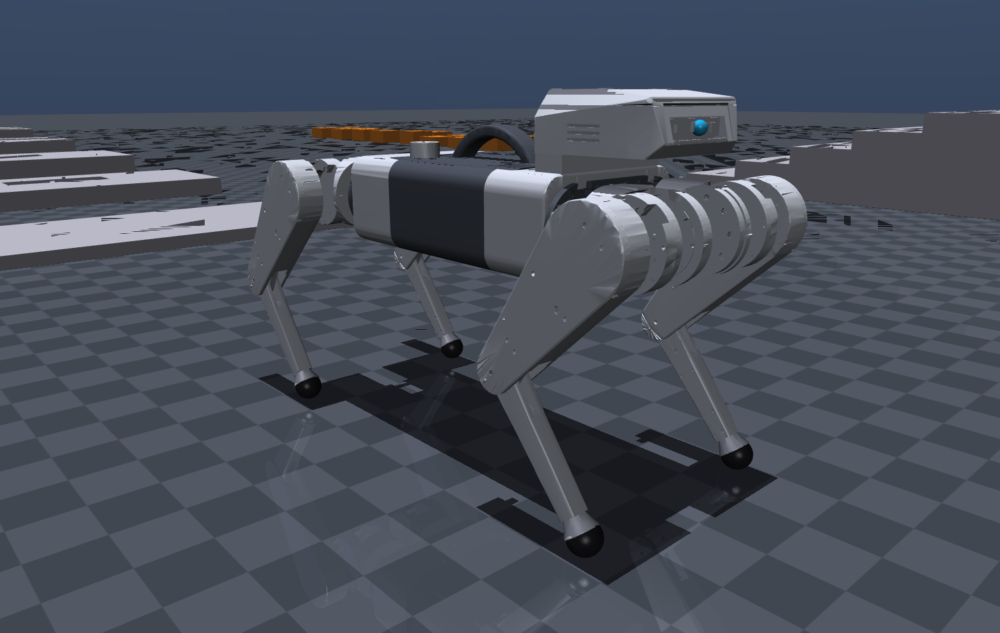
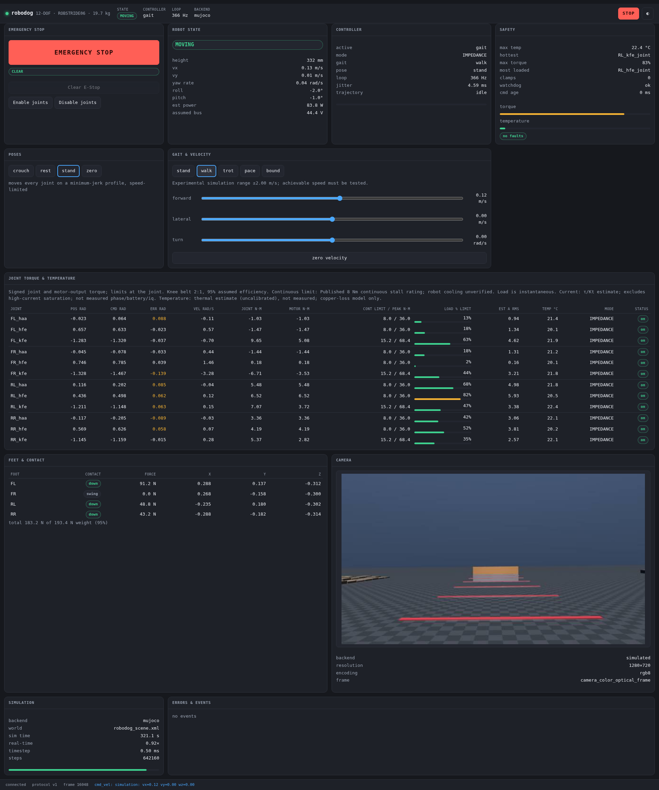
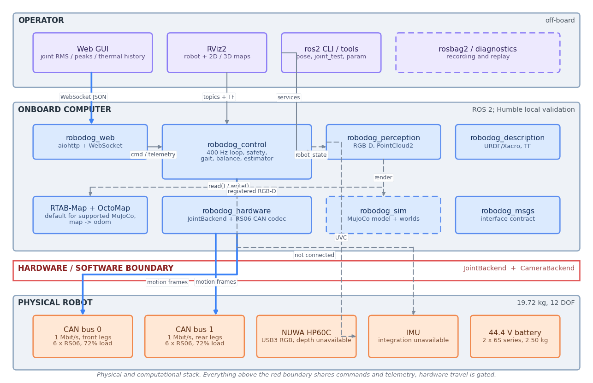
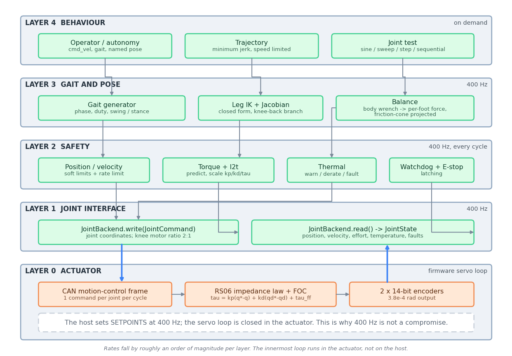
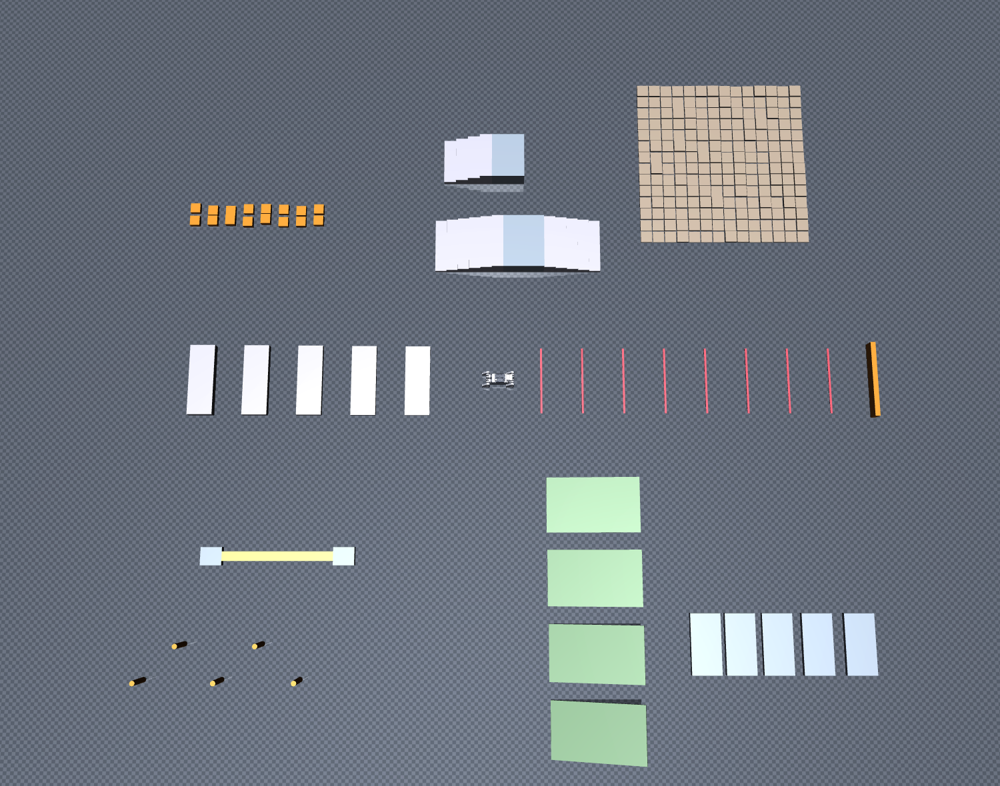
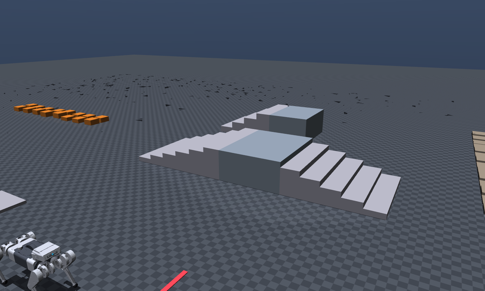
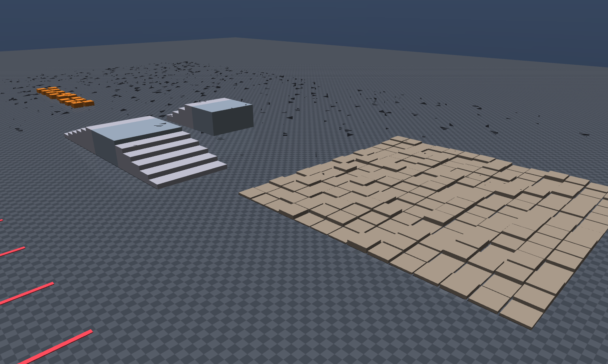
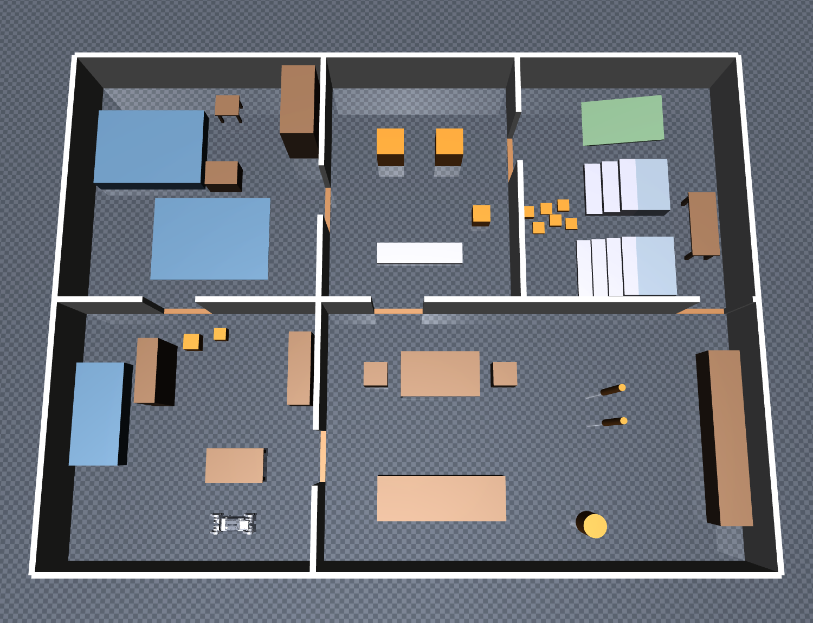

<h1 align="center">robodog</h1>

<p align="center">
  <b>Software architecture for a 12-DOF quadruped robot</b><br>
  12 × RobStride RS06 · ≈19.72 kg · ROS 2 · MuJoCo
</p>

<p align="center">
  
  
  
  
  
</p>

<p align="center">
  
</p>

---

## What this is

A complete, working **first software architecture** for a quadruped robot built
around twelve [RobStride RS06](https://robstride.com) quasi-direct-drive actuators.
It takes a raw Onshape CAD export and turns it into a running robot stack: a
kinematic and inertial model, a 400 Hz control loop with a real safety layer,
gait generation, physics simulation with a five-room test house, an RGB-D
perception pipeline, and a web GUI you can drive it from.

Everything runs today, in simulation. **No hardware has been driven** — the
RobStride CAN driver and the camera driver are written but unvalidated, and
the project is explicit about which numbers are measured and which are
estimates waiting for a real robot.

The organising idea is a single abstraction:

```python
class JointBackend(ABC):
    def read(self)  -> JointState        # position, velocity, effort, temperature, faults
    def write(self, cmd: JointCommand)   # position, velocity, effort, kp, kd
    def step(self, dt) -> None           # advance a simulator; a no-op on hardware
    def base_state(self) -> BaseState | None   # None on the real robot — it has no such sensor
```

Three implementations exist — ideal-kinematic, MuJoCo, and RobStride-over-CAN
— and the camera has the same arrangement. Switching from simulation to the
real robot selects a backend through launch arguments. Core joint command and
telemetry contracts stay the same. Camera registration and mapping availability
depend on the selected sensor pipeline; real depth and base odometry are not
integrated yet.

`JointCommand` is deliberately the actuator's **native impedance frame**, which
is exactly one CAN message, because the RS06 closes
`τ = kp(q*−q) + kd(q̇*−q̇) + τ_ff` in firmware at tens of kHz. The host sets
setpoints; it is not the servo. That is also why 400 Hz is enough — and 400 Hz
is precisely what the two-bus CAN budget allows.

---

## Quick start

```bash
# dependencies beyond a standard ROS 2 install (locally validated on Humble)
python3 -m pip install --user mujoco  # physics and the simulated camera
python3 -m pip install --user aiohttp # web GUI HTTP and WebSocket server
python3 -m pip install --user python-can # only needed for real hardware
sudo apt-get install avahi-daemon avahi-utils python3-pil ros-humble-rtabmap-slam ros-humble-rtabmap-util ros-humble-rtabmap-sync ros-humble-octomap-server

git clone https://github.com/farouk15160/robodog.git
cd robodog/ros2_ws
rosdep install --from-paths src --ignore-src -r -y
colcon build --symlink-install && source install/setup.bash

ros2 run robodog_sim generate_models        # build the MuJoCo models
ros2 launch robodog_bringup robot.launch.py backend:=mujoco world:=house
```

Open **http://localhost:8080** on the robot, or
**http://<robot-ip>:8080/remote** from a phone or laptop on the same trusted
LAN. The GUI listens on all interfaces and checks WebSocket origins by default.
Use `web_host:=127.0.0.1` for local-only access. Simulation automatically
enables and stands; real CAN hardware stays disabled unless explicitly enabled,
and its joints must be physically calibrated first.

`colcon build` does not install missing Python runtime dependencies. Install them
for the same `python3` used by ROS; `python3 -c 'import aiohttp, mujoco'` must pass
in the sourced terminal before launch. No temporary `PYTHONPATH` is needed.

| Command | What it does |
|---|---|
| `ros2 launch robodog_bringup robot.launch.py` | ideal joints, no physics — fastest way to exercise the stack |
| `… backend:=mujoco world:=flat` | full physics and RGB-D mapping on the calibration course |
| `… backend:=mujoco world:=house` | full physics and RGB-D mapping in the five-room house |
| `… backend:=mujoco mapping:=none` | full physics without SLAM processing |
| `… backend:=robstride06_can camera_backend:=nuwa_hp60c` | the real robot |
| `ros2 launch robodog_bringup display.launch.py` | inspect the URDF with joint sliders |
| `ros2 run robodog_sim viewer --world house` | MuJoCo viewer, no control stack |
| `ros2 run robodog_control pose stand` | move to a named pose |
| `ros2 run robodog_control joint_test --mode sweep` | chirp every joint |
| `ros2 run robodog_perception save_map --name workshop` | save the current room scan bundle |

If MuJoCo cannot open a GL context, set `MUJOCO_GL=egl` (or `osmesa`).

---

## The web GUI

<p align="center">
  
</p>

The browser receives telemetry at up to 20 Hz over a small versioned JSON protocol — per-joint
position, tracking error, torque, current and temperature; foot contact and
forces; safety and thermal state; simulation real-time factor; the camera
stream; pose and gait commands; and an emergency stop.

Joint diagnostics also show a rolling 20-second RMS and sampled-peak torque
summary, transmission-aware motor loads, exposure above torque references,
tracking error and thermal history. Coverage and data sources are labelled;
statistics use the received 50 Hz robot telemetry before browser throttling and
can miss brief physics-step peaks. See
[how to read the diagnostics](docs/gui_telemetry.md).

The latest GUI tests also exposed `TORQUE_LIMIT` after walking and returning to
stand in both worlds. The dashboard reports that condition; the successful
display tests do not establish a fault-free transition or comfortable motor
margins. [Recorded GUI validation](docs/gui_telemetry_validation.json) preserves
the results separately from the steady-gait benchmarks.

The browser builds itself from `robodog_web/config/web.yaml`, so adding,
removing or reordering a panel is a configuration change. Operator limits —
maximum commanded velocity, gait confirmation, whether joint jogging is allowed
at all — are configuration too, not constants buried in JavaScript.

It speaks a purpose-built protocol rather than rosbridge: less bandwidth, and a
much smaller surface from a web page that can move a 19.72 kg machine.

The **Remote Control** page adds two touch joysticks, `WASD`/arrow keyboard
control, live camera and motion/safety feedback, a simulation-only Greeting,
and an atomic **Save room scan** action. Its speed slider starts at 0.5 m/s.
Open it directly at `http://localhost:8080/remote` on the robot or
`http://<robot-ip>:8080/remote` from another LAN device, or use the Remote
Control tab.
Motion is dead-man controlled: held inputs refresh at 10 Hz, and release,
focus loss, disconnect or either server/controller timeout commands zero
velocity. See the [remote-control runbook](docs/remote_control.md), including
the trusted-LAN boundary for phone access.

The repository also contains an Expo/React Native client in
[`apps/robodog_mobile`](apps/robodog_mobile). The robot advertises
`_robodog._tcp.local` with a stable device UUID, and the app also accepts a
manual IP address when multicast discovery is unavailable. The native cockpit
validates and shows read-only telemetry; its functional **Web Remote** loads
the robot's same-origin `/remote` page in a navigation-restricted view, keeping
the existing drive lease, origin checks, dead-man behavior and camera stream.
See the [mobile app setup and security boundary](docs/mobile_app.md).

The current camera path is a 10 Hz, 640-pixel-wide MJPEG preview fed by a 15 Hz
ROS camera, so it is not a 60 fps implementation. The app isolates the media
surface in its control screen for a later Jetson H.264/WebRTC adapter; 60 fps will only be
advertised after sensor, encoder, decoder, latency, load and thermal validation.

---

## SLAM and 3D mapping

RTAB-Map SLAM starts by default for MuJoCo with the simulated camera enabled,
providing a 2D occupancy map and a 3D OctoMap. SLAM estimates the trajectory;
OctoMap represents occupied and free space. They are used together.

```bash
ros2 launch robodog_bringup robot.launch.py backend:=mujoco world:=house
```

Use `world:=flat` for the proving ground. Maps persist separately per world.
The default `mapping:=auto` leaves mapping off for kinematic mode, hardware and
launches without the simulated camera. Use `mapping:=none` to turn it off, or
`mapping:=rtabmap` to require mapping and report unsupported configurations.
See [mapping setup, outputs and export](docs/mapping.md). Simulation uses exact
odometry; real-camera depth and real odometry remain prerequisites for hardware.
The Remote Control page can snapshot an assembled PCD, full colored OctoMap,
RTAB-Map database backup and checksum manifest. The equivalent command is
`ros2 run robodog_perception save_map --name workshop`.

## Architecture

<p align="center">
  
</p>

The red band is the hardware/software boundary. The control and joint telemetry
interfaces above it are shared by simulation and CAN hardware. Mapping is
currently supported only with MuJoCo's registered depth and base odometry.

<p align="center">
  
</p>

Rates fall by roughly an order of magnitude per layer, and the innermost loop
is not on the host at all. The safety monitor is unconditional: it runs every
cycle, in simulation as well as on hardware, because a safety layer that only
activates on the real robot has never been tested by the time it matters.

Ten diagrams cover the system, software, node/topic, control, data-flow,
hardware-boundary, state-machine, domain, simulation and perception views. They
live in [`docs/diagrams/`](docs/diagrams) as editable **Draw.io** files and are
rendered to PDF and PNG from a single source by `tools/make_diagrams.py`.

---

## Test environments

Two worlds ship. Gait work should not be debugged against furniture at the same
time, so terrain and navigation are separate.

Both include a **1.90 m standing human mannequin** beside the robot's starting
position for size comparison. Its feet rest on the floor, and the same static
geometry appears in MuJoCo and RViz. It stands clear of the forward travel lane.
See the [flat-world comparison](docs/images/human_reference_flat.png) and
[house comparison](docs/images/human_reference_house.png).

### `flat` — open-air proving ground, 24 × 24 m

<p align="center">
  
</p>

Eight independent lanes radiating from the spawn, so each problem can be
attempted on its own:

| Lane | Contains |
|---|---|
| **+x** | measured run, 1 m markers — for velocity tuning |
| **−x** | step ladder, 40 → 200 mm |
| **+y** | 6 × 80 mm up, landing, 6 × 80 mm down; plus a 4 × 130 mm flight |
| **−y** | slopes at 5°, 10°, 15°, 20° |
| **NE** | 196-tile rough terrain, 12–70 mm, seeded and reproducible |
| **NW** | stepping stones with gaps |
| **SE** | gap course, 100 → 280 mm |
| **SW** | 220 mm balance beam and a pole slalom |

<p align="center">
  
  
</p>

Rough terrain is tiles rather than a MuJoCo heightfield for one reason: the same
description has to render in RViz, and a heightfield has no marker equivalent.
Tiles also make the problem the right kind of hard — the foot either lands on a
face or it does not.

### `house` — five rooms, 12 × 9 m

<p align="center">
  
</p>

Every indoor locomotion problem, each with enough approach room to be attempted
in isolation:

| Feature | Dimension | Measured against |
|---|---|---|
| Doorways | 0.90 m, with a 20 mm sill to step over | body width 0.240 m |
| Narrow gaps | 0.45 / 0.43 / 0.60 m | foot span 0.289 m |
| Stairs | 4 × 80 mm, and 3 × 120 mm as a stretch case | 0.24 m leg lift |
| Ramp | 12° | where µ = 0.9 stops holding a static stance |
| Under-table | 0.36–0.46 m clearance | 0.320 m stance height |
| Debris field | mixed 40–110 mm blocks | foothold selection |
| Movable props | four free bodies that topple | contact recovery |

**One world description, two renderers.** `world_spec.py` is consumed by both
the MuJoCo model builder and the RViz marker publisher, so what the operator
sees is geometrically what the robot collides with. `world_check.py` measures
every clearance quoted above from the spec, and the tests fail if an edit turns
a designed challenge into a wall or an open field.

---

## Current configuration and validation

The active model uses the new export in `cad/urdf/`, twelve **RobStride RS06**
actuators and a **19.72 kg working mass**. The twelve 621 g actuators contribute
7.452 kg. The CAD export contributes approximately 7.549 kg before its tiny
placeholder motor and equipment masses are removed and real inertias are added. Battery,
electronics, wiring and mounting masses remain planning estimates.

| Mass component | Modeled mass |
|---|---:|
| New CAD export | 7.549431 kg |
| Replaced CAD motor/equipment placeholders | −0.004160 kg |
| Twelve RS06 actuators | 7.452 kg |
| Belt/pulley upgrade allowance | 0.120 kg |
| Installed electronics, batteries and remaining payload | 4.452 kg |
| Camera | 0.150 kg |
| **Total** | **19.719271 kg** |

The current geometry has 192.0 mm thighs and 195.621 mm shanks. The full-chain
reach is approximately 387.6 mm; reach reserve is a geometric quantity, not a
verified obstacle or step height.

The knee belt is a **2:1 reduction**: the RS06 output turns twice per knee turn.
At the model's assumed 95% belt efficiency, the manufacturer's 8 N·m continuous
stall value corresponds to **15.2 N·m at the knee**. Its 11 N·m rotating rating
corresponds to 20.9 N·m, and 36 N·m peak corresponds to 68.4 N·m. HAA and HFE
are direct. Knee speed halves and equivalent actuator-output inertia increases
fourfold: **0.012 kg·m² at the motor output becomes 0.048 kg·m² at the knee**.
These are transmission calculations, not verified belt or shaft strength ratings.

The [manufacturer datasheet audit](docs/rs06_datasheet_audit.md) distinguishes
the latest September 17 specification from the older July manual. The **11 N·m
rotating rating at 100 rpm requires a 200 × 200 mm aluminum heat sink**. The
separate stall table specifies **8 N·m continuous**; the controller uses that
holding value as its conservative continuous budget. At 36 N·m, the published
maximum is **1 second stalled or 4 seconds rotating**, not an indefinitely
repeatable pulse allowance. Installed cooling and overload recovery remain
unverified. The single central electronics plate does not demonstrate equivalent
cooling for twelve motors.

The latest specification publishes **Kt = 1.1 N·m/Arms**, **0.23 Ω line
resistance**, and **0.012 kg·m² equivalent output inertia**. The 0.115 Ω phase
value is derived using an equivalent-wye model, not an independently published
winding measurement. Thermal resistance and heat capacity still need
identification. Simulation temperatures remain estimates; CAN telemetry uses
the maximum of reported motor feedback and the estimated thermal observer.
A constant Kt does not capture the published peak-current discrepancy, and the
lumped copper model does not reproduce the manufacturer's per-phase stall
heating model. Phase-current estimates are neither measured DC-bus current nor
a verified conversion of the motor's Iq channel. See the audit for source pages
and caveats.

The battery model assumes the two 6S packs are **in series: 12S, 44.4 V nominal,
50.4 V fully charged**. Parallel packs provide 22.2 V nominal: within the latest manual's 15–60 V
input range, but a different speed and power envelope from this simulation.
Confirm the delivered revision and power wiring before hardware use.

See the [current speed sweep and Go2 comparison](docs/locomotion_validation.md)
for the measured operating limits and calculation method. The
[per-joint report](docs/rs06_speed_study.md), [JSON](docs/rs06_speed_study.json)
and [CSV](docs/rs06_speed_study.csv) include all twelve joints, peaks, RMS,
time above 8/11 N·m, speed during overload, and clipping. These results supersede
the earlier `rs06_feasibility` measurements: applied torque is now sampled at
every 0.5 ms physics step, and the command delay is correctly 1 ms.

The [100-second 1 m/s report](docs/rs06_1ms_100s.md) repeats the applied-torque
measurement for tuned walk and trot after a five-second RMS warmup and compares
the tuned heading hold with the preserved [baseline](docs/rs06_1ms_100s_baseline.md).
Walk still falls into an unstable, heavily limited state and averages
−0.011 m/s. Tuned trot tracks at 0.984 m/s, with worst motor-side RMS/peak of
5.36/28.64 N·m. It still has safety limiting on 30.6% of controller cycles, but
heading hold reduces lateral drift from 24.405 m to 1.063 m. The largest tuned
trot spike is the rear-left hip-pitch at 0.681 s and 0.571 m travel. This
supports a simulation feasibility finding, not hardware approval or autonomous
navigation performance.

Each speed-sweep run below lasts 20 simulated seconds on an obstacle-free
plane; RMS excludes the first second while peaks include startup. The tuned
walk uses 1.5 Hz, 0.78 duty factor and 30 mm lift at 320 mm stance; trot uses
2.2 Hz and 40 mm lift at 330 mm stance.

| Gait | Command / actual speed | Worst motor RMS / peak | Safety-clamped cycles | Result |
|---|---:|---:|---:|---|
| Stand | 0 / ≈0 m/s | 3.28 / 4.05 N·m | 0% | Stable |
| Walk | 0.15 / 0.171 m/s | 4.94 / 10.77 N·m | 0% | Tracks |
| Trot | 0.50 / 0.515 m/s | 4.79 / 13.34 N·m | 0% | Tracks |
| Trot | 0.75 / 0.756 m/s | 4.99 / 21.19 N·m | 0% | Tracks; inspect peaks |
| Trot | 1.00 / 0.979 m/s | 5.38 / 28.15 N·m | 26.8% | Tracks with limiting |
| Trot | 1.50 / 1.477 m/s | 6.49 / 30.37 N·m | 99.4% | Tracks with near-continuous limiting |
| Trot | 2.00 / 0.052 m/s | 7.21 / 35.12 N·m | 99.9% | Unstable; invalid operating point |

Low-speed straight-line simulation is promising. Higher speeds do not have
comfortable demonstrated margins, and the requested 0.3 rad/s turns only
achieved 0.127–0.144 rad/s. Short simulations and estimated temperatures do not
verify cooling, belt strength or hardware walking. Compare motor-output torque
with the RS06 rating: the knee's joint torque is 1.9 times motor-output torque
under the assumed 2:1 ratio and 95% efficiency.

The official Go2 model also completed matched 0.4 and 0.5 m/s tests using our
shared gait controller. Its peak joint caps are 23.7 N·m at the hips and
45.43 N·m at the knees; continuous ratings are not inferred. The
[comparison](docs/locomotion_validation.md) separates joint and motor torque,
model differences, and the [official SDK/viewer shutdown failure](docs/go2_runner_smoke.md).

After sourcing ROS and the built workspace, reproduce with:

```bash
MUJOCO_GL=egl python3 tools/torque_report.py --study --seconds 20 --output docs/rs06_speed_study.json
```

No hardware has been driven. Real IMU/base-state feedback is not integrated;
its absence remains explicit, and the controller rejects hardware travel
commands until live base feedback is available. The RS06 backend also requires
calibrated joints for normal enable/motion. Motor calibration, firmware checks
and identified cooling remain prerequisites for physical trials. MuJoCo provides exact base feedback, so that path has different
uncertainty from the physical robot. Pace, bound, stairs and jumps remain
experimental until individually measured.

### Historical results

The previous 10 kg RS02 model walked and trotted in simulation after fixing a
foot-target discontinuity and false hip self-collisions. Its torque percentages,
temperatures, speed tables, screenshots and architecture performance figures
are **superseded** and must not be used to size the RS06 configuration. The
regression tests retain the useful checks: continuous foot commands, free hip
motion, actual displacement, tracking, and consistency between URDF and MJCF.

---

## Repository layout

```
cad/                        Onshape export (input) and archived RS02 vendor STEP
tools/                      CAD → model pipeline, meshes, diagrams, doc facts
ros2_ws/src/
  robodog_msgs/             message and service contract
  robodog_description/      URDF/Xacro, meshes, RViz, actuator datasheet
  robodog_hardware/         JointBackend + parameterized RobStride CAN codec
  robodog_control/          400 Hz loop, safety, gait, balance, IK, estimator
  robodog_sim/              MJCF generator, test worlds, RViz markers
  robodog_perception/       CameraBackend, depth, PointCloud2
  robodog_web/              GUI server and browser front end
  robodog_bringup/          launch composition
docs/                       LaTeX documentation, Draw.io diagrams, figures
```

---

## Generated, not hand-written

| Artefact | Produced by | From |
|---|---|---|
| `robot_parameters.yaml` | `tools/cad_to_model.py` | the Onshape export |
| `meshes/*.stl` | `tools/prepare_meshes.py` | active CAD export meshes |
| `models/*.xml` (MJCF) | `robodog_sim/mjcf.py` | `robot_parameters.yaml` |
| diagrams (`.drawio`, `.pdf`, `.png`) | `tools/make_diagrams.py` | one Python description |
| `docs/generated_facts.tex` | `tools/make_doc_facts.py` | the model and the datasheet |
| preview renders | `tools/render_previews.py` | the MuJoCo models |

The URDF, the MuJoCo model, the inverse kinematics and every number in the
documentation read the same parameter file. Regenerate after a CAD change:

```bash
python3 tools/cad_to_model.py        # geometry, inertia, visual transforms
python3 tools/prepare_meshes.py      # decimate visual meshes
ros2 run robodog_sim generate_models # rebuild the MuJoCo models
cd docs && make                      # facts, diagrams, and the PDF
```

---

## Key figures

| Quantity | Active configuration |
|---|---|
| Working mass | Approximately 19.72 kg; payload placement and several masses estimated |
| Motors | 12 × RS06, 621 g each; 8 N·m continuous stall, 11 N·m rotating rated, 36 N·m peak |
| External transmission | HAA/HFE 1:1; knees 2:1, 95% efficiency assumed |
| Battery assumption | Two 6S packs in series; 44.4 V nominal, 50.4 V full |
| CAN | Two buses, six motors each; 400 Hz target, bus budget checked |
| Thermal telemetry | Estimated in simulation; feedback/observer maximum on CAN |

Geometry, named poses and inertias are generated in
`ros2_ws/src/robodog_description/config/robot_parameters.yaml`.

---

## Tests

```bash
source /opt/ros/humble/setup.bash
source ros2_ws/install/setup.bash
cd ros2_ws
PYTEST_DISABLE_PLUGIN_AUTOLOAD=1 MUJOCO_GL=egl python3 -m pytest src/*/test ../tools/test_go2_benchmark.py -q
```

The latest recorded run passed **364 tests**. The pure GUI statistics module and
mapping policy each have 100% statement coverage; this is not a repository-wide
coverage claim. [GUI verification](docs/gui_telemetry.md#verification) distinguishes
passing display checks from the remaining walk-to-stand torque-limit condition.

With the MuJoCo GUI running, `python3 tools/gui_smoke.py` from the repository
root exercises actual browser commands, all twelve live/statistics rows and the
robot model panel, and saves screenshots plus JSON. It commands a short walk,
then requests zero velocity and stand; it does not assert a sustained fault-free
stand. It needs
Python Playwright and Google Chrome and refuses a hardware backend. On Humble,
use `PYTEST_DISABLE_PLUGIN_AUTOLOAD=1` if an unrelated ROS pytest plugin fails
to load; GUI access tests also require permission to open local sockets.

Run the regression suite for the current checkout. The
valuable ones are cross-checks rather than unit tests: the
MuJoCo model's masses, joint origins, axes, ranges and visual-mesh orientations
are asserted against the URDF, so the two descriptions cannot drift apart; the
world geometry is measured against the clearances its own docstring claims; and
the RobStride CAN codec has tests that run with no hardware, because that is the
part most likely to need changing for a different firmware revision.

Several tests exist because a bug got past a weaker one — a gravity-torque sign
inversion, an idle-command rate-limiter seed, a camera self-occlusion fraction,
and a Euler-convention mismatch that left the rendered legs floating beside the
body while every physics test passed. Each of those says so in its docstring.

---

## Before powering a real robot

1. **Verify the CAN frame layout** against the delivered firmware — the
   identifier layout has varied across RobStride revisions. It is isolated in
   `robodog_hardware/protocol/robstride06.py`, so a revision touches one file.
2. **Calibrate every joint.** `ros2 run robodog_hardware calibrate_joint
   --joint FL_haa_joint --lower-limit -0.80`. Direction and offset are unknown
   until the robot is assembled. Leave startup disabled and mark each joint
   `calibrated: true` only after its physical commissioning is complete.
3. **Identify the remaining estimates** — joint friction, belt losses and thermal
   constants; validate the published equivalent output inertia in the assembly. They are marked `[ESTIMATE]` in the selected `robstride06.yaml`, and the
   safety margins currently carry that uncertainty.

The architecture document's **Migration to hardware** section has the full
bring-up sequence and the list of open items.

---

## Documentation

[**`docs/robodog_architecture.pdf`**](docs/robodog_architecture.pdf) — current architecture, validation limits and historical measurements
covering the system and software architecture, ROS node and topic structure,
control and simulation architecture, the hardware/software boundary, coordinate
and joint conventions, safety limits, RGB-D mapping, GUI diagnostics and the
migration path to hardware. Configuration macros are generated from the robot
model; measured results retain their test conditions and source reports.
Rebuilding the PDF does not rerun simulations or validate hardware.

```bash
cd docs && make
```

---

## Licence

[Apache-2.0](LICENSE). Third-party CAD included for reproducibility is listed
in [NOTICE](NOTICE) and is not covered by that licence.
