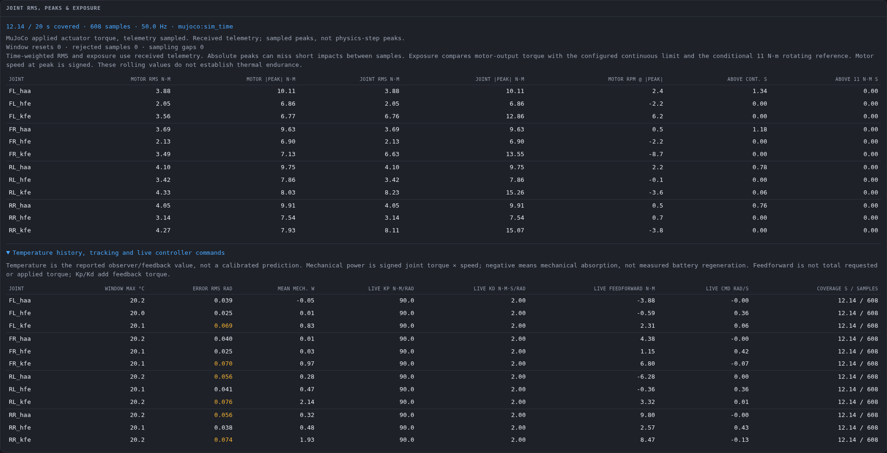

# Reading the robot diagnostics

The web GUI separates current joint readings from a rolling load summary. Use
the live readings to inspect motion and faults, and the rolling statistics to
compare repeated steps. The robot information panel describes the configured
model; it is not a measurement of an assembled robot.



## Torque and speed conventions

Joint torque is the torque after the external transmission. Motor torque means
the RS06 actuator output before the external belt; the RS06 internal gearbox
is already included. For the knee's 2:1 reduction and assumed 95% efficiency:

```text
motor torque = knee joint torque / (2 × 0.95)
motor speed = knee joint speed × 2
```

The other joints have no external reduction. The live torque is signed. RMS
and absolute peaks are nonnegative. A feedforward torque command is only one
term in the impedance controller; it is not the controller's total requested
torque. Comparing feedforward against feedback does not establish clipping.

The configured continuous motor baseline is 8 N·m, based on the published stall
rating. The 11 N·m rotating rating is a separate reference with cooling and
speed conditions. Time above either reference is descriptive exposure, not a
prediction of time to motor failure. The configured peak rating is 36 N·m at
the actuator output. See the [RS06 source audit](rs06_datasheet_audit.md).

## Rolling statistics

Statistics are computed by the web server from received robot telemetry before
the browser's 20 Hz display throttling. The control stack normally publishes
robot telemetry at 50 Hz. These are **telemetry-sampled peaks**: loads between
messages can be missed, so this panel does not replace the physics-step torque
audit used for motor sizing.

RMS uses elapsed sample time rather than averaging displayed frames:

```text
torque RMS = sqrt(sum(torque² × valid interval) / sum(valid interval))
```

Each sample is held over its following valid interval. The rolling window is
20 seconds; shorter valid history is shown while it fills. MuJoCo uses
simulation time, so slower-than-real-time rendering does not inflate exposure
durations. Kinematic mode and hardware use message timestamps. Gaps over
0.25 seconds or invalid joint samples restart coverage. Duplicate and slightly
reversed timestamps are rejected; a reversal over one second or a change of
clock source restarts the timeline. The display reports these gaps, rejections
and resets. Missing or invalid history is not reported as zero load. A server
restart starts a new statistics history; a browser refresh does not reset it.

Speed at peak is the motor speed at the received sample with the largest
absolute torque in the window. It is not the maximum speed reached elsewhere
in the window. Tracking RMS describes position error, in radians.

## Estimates and limits

- MuJoCo torque comes from the applied physics actuator effort sampled into
  telemetry. CAN torque is actuator feedback; kinematic torque is synthetic.
- Current is a torque/Kt estimate in equivalent phase RMS amperes. It is not a
  measured phase, battery or iq current, and it excludes high-current saturation.
- Simulation temperature is an uncalibrated copper-loss thermal estimate. The
  CAN path uses the maximum of reported temperature and the thermal observer.
- Bus voltage is assumed and electrical power is estimated. Mechanical power
  is signed joint torque multiplied by joint velocity, not battery power.
- Safety clamp counts are aggregate command-limiter events. Per-joint actuator
  clipping is not available from this telemetry stream.

Use `backend:=mujoco` to inspect simulated loads. RTAB-Map now starts by default
when the simulated camera is enabled. Set `mapping:=none` when measuring the
control stack without mapping load. Mapping details are in the
[mapping runbook](mapping.md).

## Verification

The live Chrome test on 2026-09-28 exercised pose transitions, a 0.12 m/s walk
command, all twelve joint rows, expanded controller details and robot model
information without browser errors. It then stopped walking and filled a full
20-second history at approximately 50 Hz, with no dropped samples or gaps.
RTAB-Map started with the default mapping setting and published 2D and 3D maps.
All launched nodes shut down cleanly. [Recorded results](gui_telemetry_validation.json)
include the sample statistics and the test's limitations; these mixed-motion
values are not a steady-gait motor-sizing result.

The pure statistics module has 100% statement coverage. Tests cover irregular
sample timing, signed torque, knee transmission, partial rolling intervals,
reset/gap handling, invalid values and bounded memory. Browser renderer tests
verify that unavailable data remains unavailable instead of appearing as zero.
The full regression suite passed all 364 tests.

The separate check requiring a fault-free stand after walking **did not pass**:
both house and flat runs reported `TORQUE_LIMIT` after the transition, with
aggregate limiter counts increasing. The captured house history identifies the
rear-right hip-roll joint at the configured continuous budget. This is a
remaining controller/load limitation, not evidence of comfortable motor margins.
The GUI exposes it; this change does not alter gait behavior or safety limits.
