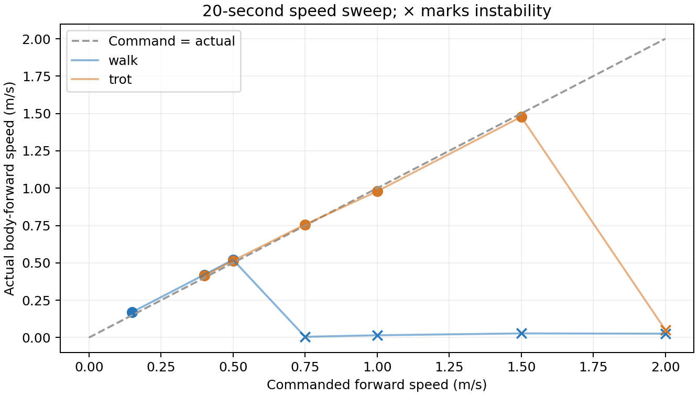
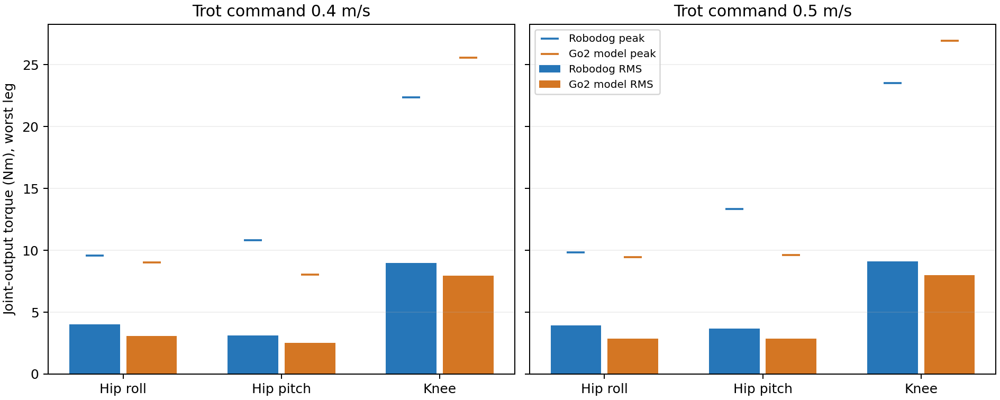

# Locomotion and applied-torque validation

The normal launch dependency and command-ordering paths were repaired. The
active loaded simulation is **28.000 kg**: an 8.280729 kg centered, removable
test ballast is added to the 19.719271 kg base configuration. It uses 12 RS06
actuators and 2:1 external knee reduction with assumed 95% efficiency. GUI
velocity range reaches 2 m/s in simulation; accepting a command does not
establish that a gait can execute it.

The normal ROS viewer launch also passed a direct `/cmd_vel` smoke test: a 0.2 m/s command moved the robot 0.616 m in 3 simulated seconds, with finite applied-torque telemetry on all 12 joints and an acknowledged return to standing. The browser walking test advanced 0.806 m, verified all 12 torque/current/temperature rows and the simulation slider range. [Live test evidence](live_launch_validation.json) records both checks.

**Later walk-to-stand limitation:** the expanded GUI validation on 2026-09-28 reproduced `TORQUE_LIMIT` after stopping in both house and flat worlds. The captured house run identifies the rear-right hip-roll joint at the configured continuous budget, with aggregate safety-clamp counts increasing. Acknowledged stand commands and the successful standing-keyframe benchmark below do not validate this transition. The GUI's 20-second, 50 Hz sampled statistics and [validation record](gui_telemetry_validation.json) expose this condition; they do not replace the 2 kHz applied-torque measurements below.

**Remaining lifecycle issue:** an interrupt-driven viewer shutdown produced teardown errors, including a controller SIGSEGV. The official Unitree viewer also crashed during shutdown. Their causes remain unresolved; the successful walking checks do not establish clean viewer shutdown.

The later headless GUI/mapping test processes shut down cleanly. That result does not resolve the interactive viewer shutdown issue.

## 28 kg, 100-second 1 m/s check

The extended check uses the same obstacle-free sizing plane, 400 Hz controller
and 2 kHz applied-physics-torque sampling. Both cases run for 100 simulated
seconds. RMS excludes the first five seconds; peaks and overload duration
include startup. The knee tables report both joint-side torque and motor-output
torque: with the 2:1 belt and assumed 95% efficiency,
`motor torque = joint torque / 1.9` and motor speed is twice knee speed.

| Gait | Command / actual m/s | Tilt / min height | Worst motor RMS / peak N·m | Largest spike | Safety-clamped cycles | Stable / tracks / margin |
|---|---:|---:|---:|---|---:|---|
| walk | 1.00 / −0.01096 | 33.17° / 0.14857 m | 7.681 / 32.159 | FR hip pitch, 0.3335 s | 99.82% | No / no / no |
| trot, heading hold | 1.00 / 0.922506 | 8.6559° / 0.32165 m | 6.749 / 34.897 | RL hip pitch, 0.6810 s, 0.4776 m travel, [0.467, 0.054, 0.323] m | 87.965% | Yes / no / no |

The loaded walk falls and is not a valid operating point; its post-failure RMS
does not describe successful walking. The loaded trot remains upright but
misses the 1 m/s tracking criterion and has no comfortable motor margin. Its
worst spike is the rear-left hip-pitch motor at 0.681 s. The run reports
position, velocity and torque fault bits for walk, and velocity and torque bits
for trot. There is **no peak-torque clipping and no physics-actuator clipping**
in either run. The high clamp percentages instead come from the safety monitor
and the modeled speed/voltage torque envelope, so the absence of actuator
clipping is not evidence of adequate margin. Thermal values are uncalibrated
estimates.

Compared with the historical 19.719271 kg heading-hold trot, actual speed falls
from 0.984 to 0.923 m/s, worst motor RMS rises from 5.360 to 6.749 N·m, peak
rises from 28.638 to 34.897 N·m, and safety-limited cycles rise from 30.6% to
88.0%. The [full 28 kg per-joint report](rs06_28kg_1ms_100s.md),
[JSON](rs06_28kg_1ms_100s.json), [CSV](rs06_28kg_1ms_100s.csv) and
[evaluated MuJoCo model](rs06_28kg_1ms_100s.xml) preserve the measurements.
The earlier [19.719 kg report](rs06_1ms_100s.md) remains historical comparison
evidence.

## Historical 19.719 kg speed sweep

Every case starts from the standing keyframe with a velocity step, on an obstacle-free plane. Each run lasts 20 simulated seconds; RMS excludes the first second, while peaks/overload durations include it. Physics runs at 2 kHz, control at 400 Hz, command delay 1 ms. Robot safety remains active. A successful speed must stay upright, track its command, and be assessed together with clipping—not RMS alone.

| Gait | Command / actual m/s | Worst motor RMS / peak Nm | Safety-clamped cycles | Stable / tracks |
|---|---:|---:|---:|---|
| stand | 0.00 / -0.000 | 3.28 / 4.05 | 0.0% | True / True |
| walk | 0.15 / 0.171 | 4.94 / 10.77 | 0.0% | True / True |
| walk | 0.40 / 0.420 | 5.36 / 23.59 | 0.0% | True / True |
| walk | 0.50 / 0.521 | 5.91 / 29.30 | 60.6% | True / True |
| walk | 0.75 / 0.005 | 7.67 / 30.75 | 98.4% | False / False |
| walk | 1.00 / 0.015 | 7.68 / 31.63 | 98.8% | False / False |
| walk | 1.50 / 0.028 | 6.90 / 34.64 | 99.4% | False / False |
| walk | 2.00 / 0.026 | 7.01 / 35.70 | 99.6% | False / False |
| trot | 0.40 / 0.414 | 4.73 / 11.78 | 0.0% | True / True |
| trot | 0.50 / 0.515 | 4.79 / 13.34 | 0.0% | True / True |
| trot | 0.75 / 0.756 | 4.99 / 21.19 | 0.0% | True / True |
| trot | 1.00 / 0.979 | 5.38 / 28.15 | 26.8% | True / True |
| trot | 1.50 / 1.477 | 6.49 / 30.37 | 99.4% | True / True |
| trot | 2.00 / 0.052 | 7.21 / 35.12 | 99.9% | False / False |

Failed/fallen runs include loads after instability and are not valid operating points. Frequent safety limiting also prevents calling a tracking run comfortable. The separate speed-envelope reduction is an approximate motor model, not a measured RS06 torque-speed curve.



## Turning load tests

| Forward command / actual m/s | Yaw command / actual rad/s | Worst motor RMS / peak Nm | Stable / tracks both |
|---|---|---|---|
| 0.40 / 0.407 | 0.30 / 0.127 | 5.24 / 13.42 | True / False |
| 0.50 / 0.507 | 0.30 / 0.144 | 5.01 / 13.69 | True / False |

Actual forward/lateral speed is measured in the body yaw frame. These runs expose yaw tracking error; they must not be represented as successful execution of the requested turn rate.

## Historical 19.719 kg official Go2 model comparison

Both models use MuJoCo 3.13.0, the same plane/contact parameters, gravity, solver, timestep, 20-second duration, 1-second RMS warmup, 1 ms delay, 2 mm initial clearance and shared trot generator/gains. Masses differ: Robodog 19.719 kg versus Go2 model 15.206408 kg. Go2 retains its official inertias and actuator caps; Robodog retains its RS06 speed envelope and safety limiter. This is a shared-controller model comparison, **not Unitree factory-controller performance**. No external force drives either floating base.

The primary comparison is **joint-output torque**. The extra Robodog motor column is before the knee belt; its knee value is therefore smaller than joint torque by 1.9. Each cell is worst-leg RMS / worst-leg peak, which can belong to different legs.

| Speed | Joint group | Robodog joint RMS / peak Nm | Robodog motor RMS / peak Nm | Go2 joint RMS / peak Nm |
|---:|---|---:|---:|---:|
| 0.4 | Hip roll | 4.01 / 9.57 | 4.01 / 9.57 | 3.08 / 9.01 |
| 0.4 | Hip pitch | 3.12 / 10.83 | 3.12 / 10.83 | 2.51 / 8.06 |
| 0.4 | Knee | 8.99 / 22.38 | 4.73 / 11.78 | 7.95 / 25.59 |
| 0.5 | Hip roll | 3.92 / 9.85 | 3.92 / 9.85 | 2.87 / 9.47 |
| 0.5 | Hip pitch | 3.66 / 13.34 | 3.66 / 13.34 | 2.87 / 9.63 |
| 0.5 | Knee | 9.10 / 23.53 | 4.79 / 12.39 | 8.02 / 26.94 |

Go2 model limits are 23.7 Nm for hip roll/pitch and 45.43 Nm for knees. They are peak model caps, not continuous thermal ratings. [Pinned source audit](go2_benchmark_sources.md) and [full Go2 results](go2_benchmark.md) give provenance and all 12 joints.



## How physical parameters and torque are calculated

1. **Geometry/mass:** joint transforms, link masses, COMs and inertia tensors come from the supplied CAD URDF. Twelve motor placeholders are replaced by 0.621 kg RS06 motors; battery/electronics/belt additions give a 19.719271 kg base configuration. The current loaded test adds 8.280729 kg at the body center for an exact 28.000 kg total. Known placeholders are replaced rather than counted twice.
2. **Inertia:** rotate each CAD inertia into its link frame and add it about the combined COM using `I = Σ(R I_part Rᵀ + m[(r·r)I₃ − rrᵀ])`. Motor housing inertia uses an estimated uniform 88×49 mm cylinder; payload additions use declared point-mass locations. RS06 output-equivalent armature is 0.012 kg·m²; the 2:1 knee reflects this to 0.048 kg·m². Those are distinct from housing/link rigid-body inertia.
3. **Requested joint torque:** `τ_req = Kp(q_target−q) + Kd(q̇_target−q̇) + JᵀF`. The balance controller distributes support/acceleration forces across stance feet; nominal equal static support for the 28 kg loaded case is `mg/4 ≈ 68.7 N` per foot. It then applies joint limits, the overload/temperature gate and the motor envelope.
4. **Reported torque:** read MuJoCo `qfrc_actuator` at each hinge DOF every 0.5 ms. This is applied actuator torque after clamping/gearing—not the PD request, and not the total impact/reaction torque on bearings or structures. For the knee, `τ_motor = τ_joint/(2×0.95)` and `ω_motor = 2ω_joint`; hips use ratio 1.
5. **Peak/RMS/overload:** `peak=max(|τ_motor|)`; `RMS=√(Στ_motor²Δt/ΣΔt)`. For every joint, record cumulative and longest consecutive time above 8 and 11 Nm, speed at peak, speed during overload, and separate software/peak/speed-envelope/MuJoCo clipping. The threshold durations include startup and are sampled at the physics rate.

Temperatures remain uncalibrated model estimates. These results do not establish cooling, belt strength, motor mounting, repeated-impact life or battery/regeneration capability.

## Reproduce

```bash
source /opt/ros/humble/setup.bash
source ros2_ws/install/setup.bash
python3 tools/torque_report.py --study --seconds 20 --output docs/rs06_speed_study.json
python3 tools/torque_report.py \
  --gaits walk trot --velocity 1.0 --seconds 100 --warmup 5 \
  --study-label 28kg_1ms_100s \
  --baseline-report docs/rs06_1ms_100s.json \
  --output docs/rs06_28kg_1ms_100s.json
python3 tools/go2_benchmark.py --repo /tmp/robodog-unitree-mujoco --seconds 20 --output docs/go2_benchmark.json
python3 tools/compare_benchmarks.py
```

The Go2 repository checkout must match the pinned revision in its report. [All RS06 joint measurements](rs06_speed_study.md), [machine-readable JSON](rs06_speed_study.json) and [flat CSV](rs06_speed_study.csv) retain the detailed measurements. The [official viewer/SDK smoke result](go2_runner_smoke.md) is separate from the matched-model benchmark.
